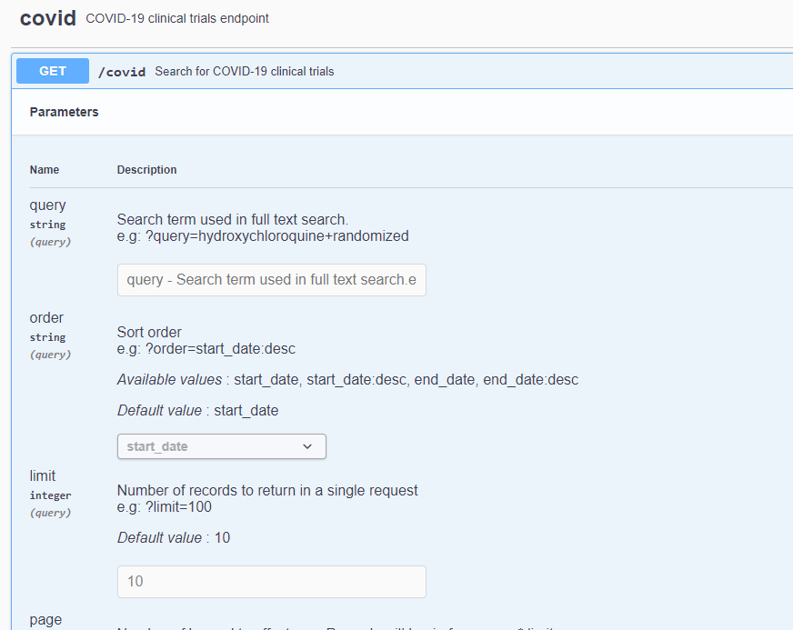

# NodeJS Upskill Project / Clinical Trials Search API

##### Table of Contents
- [Motivation](#motivation)
- [Tech Stack](#tech-stack)
- [Architecture](#architecture)
- [Installation](#installation)
- [API Reference](#api-reference)
- [License](#license)

## Motivation
Basic upskill project on the tech stack described below.


## Tech Stack
1) NodeJS
2) Async primitives:  async-await
3) Test framework: Jest / Supertest
4) HTTP server framework: Express (e.g. routers, middleware)
   - Leveraged Joi for validation
5) HTTP client: Axios
6) ~~HTTP Request GUI:  Paw (Postman is an option too but server devs are all on Paw now)~~
7) Docker
8) Data Formats: YAML, JSON
9) PostgreSQL
10) ~~Redis~~ - In the early phase of development - disabled caching on purpose
11) Swagger / JSON Schema
12) CI/CD: CircleCI, Harness - work in progress
13) ElasticSearch
14) ~~Infrastructure as code:  Terraform~~


Avoiding ORM as I believe it's a leaky abstraction, but I did decide to add a relation db query builder -> knex.
This is arguable another leaky abstraction, but it's very close to SQL but provides a few security and convenience features.

## Architecture
[](https://blog.cleancoder.com/uncle-bob/2012/08/13/the-clean-architecture.html)
Leveraging clean architecture to ensure business logic is not coupled to the tech choices.
>"The overriding rule that makes this architecture work is The Dependency Rule. This rule says that source code dependencies can only point inwards. Nothing in an inner circle can know anything at all about something in an outer circle."

To highlight this fact this project adds support for two repositories (PostgreSQL and Elasticsearch) as well as two http 
frameworks (Express and Hapi).

## Installation
```
1) git clone https://github.com/jessehjackman/clinical-trials.git
2) cd clinical-trials
3) rename/move template.env -> .env (update if desired) 
4) configure PostgreSQL
    a) docker build -t covid-trials-postgres-image .
    b) docker run -d --name covid-trials-postgres-container -p 5555:5432 covid-trials-postgres-image
    C) If desired you may run init.sql on an existing PostgreSQL server
4) npm install
5) npm test
6) npm start

(optional) Config Elasticsearch by following AWS directions and setting the appropriate env settings,
 e.g. endpoint and master username + password. I did not include the raw data here but you can extract 
 it from init.sql or from PostgreSQL directly.

```
## API Reference
Swagger docs available at the /api-docs endpoint upon installation (express framework only)

i.e. http://localhost:3000/api-docs/#/covid/find-covid-trials

Example:


## License
MIT © [Jesse Jackman]()