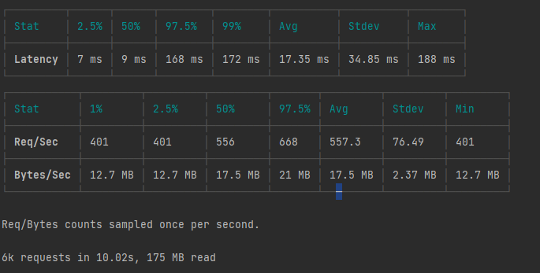

# NodeJS Upskill Project / Clinical Trials Search API

##### Table of Contents
- [Motivation](#motivation)
- [Tech Stack](#tech-stack)
- [Architecture](#architecture)
- [Project Structure](#project-structure)  
- [Installation](#installation)
- [API Reference](#api-reference)
- [Test Plan](#test-plan)
- [Performance](#performance)
- [TODO](#todo)

## Motivation
Basic upskill project on the tech stack described below.

## Tech Stack
1) NodeJS / JavaScript
2) Async primitives:  async-await
3) Test framework: Jest / Supertest
4) HTTP server framework: Express (e.g. routers, middleware)
5) HTTP client: Axios
6) Docker
7) Data Formats: YAML, JSON
8) PostgreSQL
9) ~~Redis~~ - In the early phase of development - disabled caching on purpose
10) Swagger / JSON Schema
11) CI/CD: CircleCI, Harness - work in progress
12) ElasticSearch

Avoiding ORM as I believe it's a leaky abstraction, but I did decide to add a relation db query builder -> knex.
This is arguable another leaky abstraction, but it's very close to SQL and provides a few security and convenience features.

## Architecture
[](https://blog.cleancoder.com/uncle-bob/2012/08/13/the-clean-architecture.html)
Leveraging clean architecture to ensure business logic is not coupled to the tech choices.
>"The overriding rule that makes this architecture work is The Dependency Rule. This rule says that source code dependencies can only point inwards. Nothing in an inner circle can know anything at all about something in an outer circle." - Bob Martin

To highlight this fact this project adds support for two repositories (PostgreSQL and Elasticsearch) as well as two http 
frameworks (Express and Hapi). Note: As currently implemented Hapi does not support swagger nor supertest.

A respected coworker commented: "no one can seem to agree on what a use case is vs. repository and whether the use case really adds any value." 
Most examples found on the web of clean architecture suffer from this exact complaint (this example as well). 
The motivation behind leveraging clean architecture is a direct response to tight coupling that has burned some projects that I've worked on in the past. 
Clean Architecture offers solutions to tech lock-in and isolating business logic for easier testing.
A bit of diligence to adhere to the architecture's ideals (some upfront pain) can save the project from spaghetti code especially when timelines are tight and developers are in get it done mode.

All that being said, if the backend is to truly fetch data from a repository then the use case layer is in fact useless. 
I might add a fake 'requirement' to this example. For example, let's say for the sake of argument, we had a requirement to support natural language processing - precisely 
sentiment - so the user could further be informed about the results of a clinical trial based on positive or negative sentiment. 
Also, assume we don't own the data, so we can't directly bake it into the repository (as we can in this example). 
I thought that might be an actual use case that isn't just served by a repository pass-through, where you might string various endpoint calls together (or less likely compute the results in a worker thread).

## Project Structure

```
root 
 └ /lib                             → Application source code 
    └ application                   → Application services
       └ use_cases                  → Application business logic 
    └ domain                        → Domain model objects and repository interfaces
    └ infrastructure                → Frameworks, and tools such as Databases, and other tools
       └ config                     → Configuration including the service-locator which is the source for dependency inversion
       └ repositories               → Implementation of domain repository interfaces (postgresql, elasticsearch)
       └ webserver                  → Web server configuration (server, routes, plugins/middleware, etc.) - expressjs and hapi
    └ interfaces                    → Adapters and formatters for use cases and entities to external agency such as Database or the Web
       └ controllers                → Route handlers
       └ expressjs-routes           → express route definitions
       └ hapijs-routes              → Hapi route definitions
       └ serializers                → Converter objects that transform internal data to the outside world and the inverse
 └ /node_modules (generated)        → NPM dependencies
 └ /docs                            → swagger.json and various readme resources
 └ /test                            → Source folder for unit or integration/supertest tests
 └ index.js                         → Main application entry point
 └ Dockerfile                       → Dockerfile to scaffold PostgreSQL with data
 └ init.sql                         → PostgreSQL SQL to create table, insert data, & index
```

## Installation
```
1) git clone https://github.com/jessehjackman/clinical-trials.git
2) cd clinical-trials
3) rename/move template.env -> .env (update if desired) 
4) configure PostgreSQL
    a) docker build -t covid-trials-postgres-image .
    b) docker run -d --name covid-trials-postgres-container -p 5555:5432 covid-trials-postgres-image
    C) If desired you may run init.sql on an existing PostgreSQL server
4) npm install
5) npm test
6) npm start

(optional) Config Elasticsearch by following AWS directions and setting the appropriate env settings,
 e.g. endpoint and master username + password. I did not include the raw data here but you can extract 
 it from init.sql or from PostgreSQL directly.

```
## API Reference
Swagger docs available at the /api-docs endpoint upon installation (express framework only)

i.e. http://localhost:3000/api-docs/#/covid/find-covid-trials

Example:


## Test Plan
Test Strategy | Category | Description
-------------|----------|------------
**Positive tests** | |
*Execute GET with no parameters*|Validate Status Code| 200
| | validate payload | Response is well formed JSON & structure is validated
| | validate headers | content type, cache-control, X-powered-By
*Optional Parameters* | |
| | validate status| 200
| | validate Filter | ensure the response is filtered only by the specified value(s)
| | validate sort | ensure asc, desc sort are strictly adhered to 
| | validate limit | ensure results are limited by the specified value
| | validate page | ensure paging is adhered to
| | validate query | ensure results of the abstract contain the query terms,  also check that nonsensical query terms return no results
| | validate combinations | ensure all optional parameters can be used in conjunction 
**Negative tests**|
*Invalid Input* ||
| | Invalid path| 404
| | Invalid parameter name | ignored
| | Invalid filter value | 401- see swagger for valid strings
| | Invalid sort value | 401- see swagger for valid strings
| | Invalid page value | 401- non negative number
| | Invalid limit value | 401- 0 < limit (number) < 1001

## Performance 
#### ClinicJs Doctor : baseline


#### Against un-indexed full text search:


#### With full text search index




## TODO
- [x] Fix an unclosed handle issue with super test
- [] Fix npm test -> pass the appropriate env 
- [] Complete test plan
    - Further integration tests / supertest, fake certain invalid db records
    - add unit tests where appropriate
- [] Retry logic / short circuit pattern?
- [] Logging
- [] Health Check endpoint  
- [] Add query parameters for: (is) results available, number of enrolled?
- [] Replace require with import/from per ES 6
- [] Circle CI
- [] Secure the 'query' parameter in PostgreSQL
- [] Wire in Hapi JS into supertest
- [] Add swagger docs to Hapi JS

## License
MIT © [Jesse Jackman]()